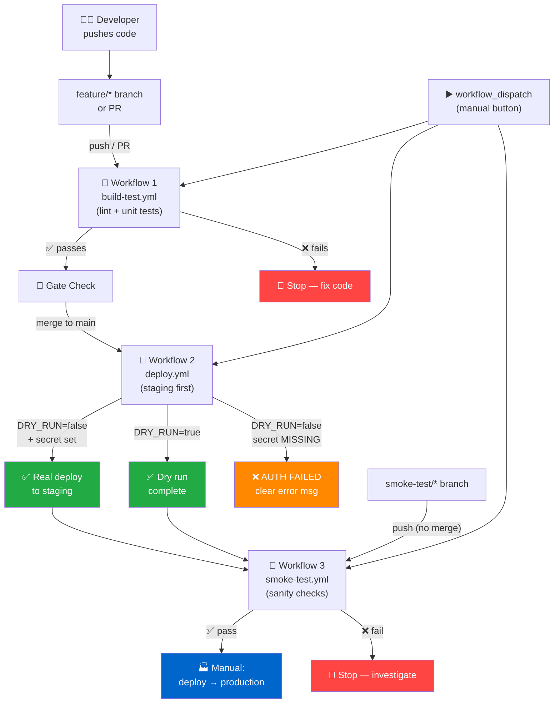

# 🚀 GitHub Actions — Hands-On Training Guide

> Windows-friendly · Branch-safe · Dry-run enabled · No toy examples

---

## 🗺️ Architecture Diagram



```
TEXT VERSION (if Mermaid doesn't render):

  [Push/PR] ──► [build-test] ──► [gate] ──► [deploy → staging]
                    │                              │
                 ❌ fail                    ┌──────┴──────┐
                 (fix it)              DRY_RUN=true   DRY_RUN=false
                                            │         ┌──────┴──────┐
                                         ✅ dry     secret OK   secret MISSING
                                         complete      │               │
                                            └────┬─────┘           ❌ AUTH
                                                 ▼                  FAILED
                                          [smoke-test]
                                         ┌──────┴──────┐
                                      ✅ pass       ❌ fail
                                         │           (investigate)
                                  [deploy → prod]
                                   (manual only)
```

---

## 📁 Folder & File Structure

```
github-actions-training/
│
├── .github/
│   ├── actionlint.yaml          # Custom runner label config for actionlint
│   └── workflows/
│       ├── build-test.yml       # Workflow 1: lint + unit tests
│       ├── deploy.yml           # Workflow 2: staged deploy with dry-run
│       └── smoke-test.yml       # Workflow 3: post-deploy sanity checks
│
├── src/
│   └── app.js                   # Our tiny calculator app
│
├── tests/
│   └── app.test.js              # Jest unit tests
│
├── scripts/
│   ├── deploy.sh                # Deploy simulation script (bash)
│   └── smoke-test.js            # Smoke test runner (Node.js)
│
├── .eslintrc.json               # ESLint rules
├── package.json                 # npm config + scripts
└── README.md                    # You are here
```

---

## 🧒 Explain Like I'm 8 — All Three Workflows

### Workflow 1 — build-test.yml 🧱

> **Imagine:** You built a LEGO car. Before showing it to anyone, you check two things:
> 1. Are all the pieces the right color and shape? **(Lint)**
> 2. Do the wheels actually spin and the doors open? **(Tests)**
>
> This workflow runs those two checks every single time you change any code.
> If either check fails, it stops and tells you exactly what's wrong.
> Nobody can see your code breaking in secret.

### Workflow 2 — deploy.yml 🚚

> **Imagine:** The LEGO car passed inspection! Now a delivery driver needs to put it on the store shelf.
> - **Dry run:** The driver practices the route without actually carrying the car. ("I'd go left, then right, then...")
> - **Real run:** The driver needs a KEY 🔑 to get into the store. No key? Locked out — clear error message.
>
> In the dry run, everything looks exactly like a real deploy — same steps, same output — but nothing actually changes.

### Workflow 3 — smoke-test.yml 💨

> **Imagine:** The car is on the shelf. You do one final walk-by check:
> - Can I still see it? ✅
> - Is it right-side up? ✅
> - Did any pieces fall off during delivery? ✅
>
> You're not rebuilding it. Just making sure it survived the trip.
> If something fell off, you catch it NOW — before customers grab it.

---

## 🔧 Local Setup — Step by Step

### Prerequisites (Windows / PowerShell)

```powershell
# 1. Check Node.js (need v18+)
node --version

# 2. Check npm
npm --version

# 3. Check git
git --version

# 4. Check GitHub CLI (optional but recommended)
gh --version

# 5. Install actionlint (Windows — using Go or Scoop)
#    Option A: Scoop
scoop install actionlint

#    Option B: Download binary from GitHub releases
#    https://github.com/rhysd/actionlint/releases
#    Put actionlint.exe somewhere on your PATH

# 6. Check actionlint
actionlint --version
```

```bash
# BASH equivalent (Git Bash / WSL / macOS / Linux)
node --version
npm --version
git --version
gh --version

# Install actionlint (Linux/macOS)
bash <(curl https://raw.githubusercontent.com/rhysd/actionlint/main/scripts/download-actionlint.bash)
./actionlint --version

# Or via Homebrew (macOS)
brew install actionlint
```

---

### Clone & Install the Project

```powershell
# PowerShell
git clone https://github.com/YOUR_USERNAME/github-actions-training.git
cd github-actions-training
npm install
```

```bash
# Bash
git clone https://github.com/YOUR_USERNAME/github-actions-training.git
cd github-actions-training
npm install
```

---

## ✅ TESTING PLAN

### Phase 1: Local Validation (Before Any Push)

#### 1A — Validate YAML with actionlint

```powershell
# PowerShell — validate all workflows at once
actionlint .github/workflows/*.yml

# Expected SUCCESS output:
# (no output = all good)

# Expected FAILURE output example:
# .github/workflows/build-test.yml:42:7: label "unknown-runner" is not
# available. Available labels are [...]
```

```bash
# Bash
actionlint .github/workflows/*.yml

# With verbose output:
actionlint -verbose .github/workflows/*.yml

# Check a single file:
actionlint .github/workflows/deploy.yml
```

#### 1B — Run tests and lint locally

```powershell
# PowerShell
npm run lint        # Check code style
npm test            # Run Jest tests
npm run smoke       # Run smoke tests
```

```bash
# Bash
npm run lint
npm test
npm run smoke
```

Expected test output:
```
PASS  tests/app.test.js
  Calculator
    ✓ add: 2 + 3 = 5 (3 ms)
    ✓ subtract: 10 - 4 = 6 (1 ms)
    ✓ divide: 10 / 2 = 5 (1 ms)
    ✓ divide: throws on divide by zero (5 ms)
    ✓ add: throws on non-numbers (1 ms)

Test Suites: 1 passed, 1 total
Tests:       5 passed, 5 total
```

Expected smoke test output:
```
🔥 Running smoke tests...

  ✅ PASS  add() returns correct value
  ✅ PASS  divide() works for happy path
  ✅ PASS  divide() throws on zero

📊 Results: 3 passed, 0 failed

🎉 All smoke tests passed!
```

#### 1C — Test the deploy script locally (dry run, no secrets needed)

```powershell
# PowerShell — dry run (always safe, no secrets required)
$env:DRY_RUN = "true"
$env:DEPLOY_ENV = "staging"
$env:APP_VERSION = "abc1234"
bash scripts/deploy.sh

# Expected output:
# ▶ Step 1/4 — Checking auth credentials...
#   [DRY RUN] Skipping real auth check. Would have used DEPLOY_API_KEY.
# ▶ Step 2/4 — Building artifact...
#   ✅ Artifact built → dist/app-abc1234.tar.gz (simulated)
# ▶ Step 3/4 — Pushing to staging...
#   [DRY RUN] Would push to staging platform endpoint.
# ▶ Step 4/4 — Verifying deployment...
#   [DRY RUN] Would run health check against staging endpoint.
# ✅  Dry run complete — no real changes made.
```

```powershell
# PowerShell — real mode WITHOUT secret (should fail clearly)
$env:DRY_RUN = "false"
Remove-Item Env:DEPLOY_API_KEY -ErrorAction SilentlyContinue
bash scripts/deploy.sh

# Expected FAILURE output:
# ▶ Step 1/4 — Checking auth credentials...
#   ❌ AUTH FAILED: DEPLOY_API_KEY secret is not set.
#      Fix: Go to Settings → Secrets → New repository secret
```

```bash
# Bash — dry run
DRY_RUN=true DEPLOY_ENV=staging APP_VERSION=abc1234 bash scripts/deploy.sh

# Bash — fail on missing secret
DRY_RUN=false bash scripts/deploy.sh
```

---

### Phase 2: Pre-Merge Remote Testing (Branch-Safe)

This is how you test workflows in GitHub without touching main.

#### 2A — Create a feature branch and push

```powershell
# PowerShell
git checkout -b feature/my-new-thing
git add .
git commit -m "feat: add my new thing"
git push -u origin feature/my-new-thing
```

```bash
# Bash
git checkout -b feature/my-new-thing
git add .
git commit -m "feat: add my new thing"
git push -u origin feature/my-new-thing
```

The `build-test.yml` workflow triggers immediately on push to `feature/**`. Check it:

```powershell
# Watch the workflow run (PowerShell)
gh run list --branch feature/my-new-thing

# Watch live
gh run watch
```

```bash
# Bash
gh run list --branch feature/my-new-thing
gh run watch
```

#### 2B — Test smoke tests without merging (dedicated branch)

```powershell
# PowerShell
git checkout -b smoke-test/verify-my-thing
git push -u origin smoke-test/verify-my-thing
# smoke-test.yml triggers immediately on push to smoke-test/**
# main is completely untouched
```

```bash
# Bash
git checkout -b smoke-test/verify-my-thing
git push -u origin smoke-test/verify-my-thing
```

#### 2C — Manually trigger any workflow from CLI

```powershell
# PowerShell — trigger build-test manually
gh workflow run "build-test.yml" --ref feature/my-new-thing

# Trigger deploy in dry-run mode
gh workflow run "deploy.yml" `
  --field environment=staging `
  --field dry_run=true `
  --ref feature/my-new-thing

# Trigger smoke tests
gh workflow run "smoke-test.yml" `
  --field target_branch=feature/my-new-thing `
  --field verbose=true
```

```bash
# Bash
gh workflow run "build-test.yml" --ref feature/my-new-thing

gh workflow run "deploy.yml" \
  --field environment=staging \
  --field dry_run=true \
  --ref feature/my-new-thing

gh workflow run "smoke-test.yml" \
  --field target_branch=feature/my-new-thing \
  --field verbose=true
```

#### 2D — Validate workflow YAML with GitHub CLI (remote lint)

```powershell
# PowerShell — push first, then validate remotely
gh workflow list                          # See all workflows
gh workflow view "build-test.yml"         # See YAML + run history
gh api /repos/OWNER/REPO/actions/workflows  # Raw API info
```

```bash
# Bash
gh workflow list
gh workflow view "build-test.yml"
```

#### 2E — Open a Pull Request to trigger PR-based workflows

```powershell
# PowerShell
gh pr create `
  --title "feat: my new thing" `
  --body "Testing the full CI pipeline" `
  --base main `
  --head feature/my-new-thing
```

```bash
# Bash
gh pr create \
  --title "feat: my new thing" \
  --body "Testing the full CI pipeline" \
  --base main \
  --head feature/my-new-thing
```

Both `build-test.yml` and `smoke-test.yml` trigger automatically on PR. The smoke test workflow will also post a comment on the PR with results.

---

### Phase 3: Post-Merge Testing

After merging to main:

```powershell
# PowerShell

# 1. Check build-test ran automatically
gh run list --workflow build-test.yml --branch main

# 2. Manually trigger a real (non-dry) deploy to staging
gh workflow run "deploy.yml" `
  --field environment=staging `
  --field dry_run=false `
  --ref main

# 3. Manually trigger smoke tests against main
gh workflow run "smoke-test.yml" `
  --field target_branch=main `
  --ref main

# 4. If all green, deploy to production
gh workflow run "deploy.yml" `
  --field environment=production `
  --field dry_run=false `
  --ref main
```

```bash
# Bash
gh run list --workflow build-test.yml --branch main

gh workflow run "deploy.yml" \
  --field environment=staging \
  --field dry_run=false \
  --ref main

gh workflow run "smoke-test.yml" \
  --field target_branch=main \
  --ref main

gh workflow run "deploy.yml" \
  --field environment=production \
  --field dry_run=false \
  --ref main
```

---

## 🔑 Secrets Setup

### Adding DEPLOY_API_KEY to GitHub

**GitHub UI:**
1. Go to your repository on GitHub
2. Settings → Secrets and variables → Actions
3. Click "New repository secret"
4. Name: `DEPLOY_API_KEY`
5. Value: `your-real-api-key-here`
6. Click "Add secret"

**GitHub CLI:**
```powershell
# PowerShell
gh secret set DEPLOY_API_KEY --body "your-real-api-key-here"

# Verify it exists (you can't see the value, just confirm it's there)
gh secret list
```

```bash
# Bash
gh secret set DEPLOY_API_KEY --body "your-real-api-key-here"
gh secret list
```

### Environment-scoped secrets (for staging vs production)

```powershell
# PowerShell — set secret for staging environment only
gh secret set DEPLOY_API_KEY `
  --body "staging-key-here" `
  --env staging

# Set secret for production environment only
gh secret set DEPLOY_API_KEY `
  --body "prod-key-here" `
  --env production
```

---

## 🏃 Self-Hosted Runner Setup

If you want to run workflows on your own machine:

```powershell
# PowerShell — download and configure runner
# 1. Go to: Settings → Actions → Runners → New self-hosted runner
# 2. Follow the instructions GitHub shows (they include a unique token)
# 3. When asked for extra labels, enter: linux-node,smoke-runner
#    (must match what you put in .github/actionlint.yaml)

# Start the runner
.\run.cmd

# Register as a Windows service (runs in background)
.\svc.ps1 install
.\svc.ps1 start
```

```bash
# Bash — same process for Linux/macOS
# 1. GitHub shows download commands specific to your OS
# 2. Run: ./config.sh --url https://github.com/OWNER/REPO --token TOKEN
# 3. When prompted for labels: linux-node,smoke-runner
./run.sh

# Register as a service (Linux)
sudo ./svc.sh install
sudo ./svc.sh start
```

### actionlint config for custom labels

`.github/actionlint.yaml` is already set up. It tells actionlint to accept these custom labels without errors:

```yaml
self-hosted-runner:
  labels:
    - linux-node
    - smoke-runner
    - windows-deploy
    - macos-build
```

Add your own labels here. If you skip this file and use custom labels in workflows, actionlint will report errors like:
```
label "smoke-runner" is not available. Available labels are [ubuntu-latest, ...]
```

---

## 🔥 Troubleshooting Table

| Error | What It Means | Exact Fix |
|-------|---------------|-----------|
| `DEPLOY_API_KEY secret is not set` | The deploy script ran in real mode but the secret is missing | Add the secret: `gh secret set DEPLOY_API_KEY --body "your-key"` |
| `npm ci failed: package-lock.json missing` | Lock file not committed to git | Run `npm install` locally, commit `package-lock.json`, push |
| `ESLint: error 'x' is defined but never used` | You have an unused variable | Remove the variable or use it |
| `actionlint: label "X" is not available` | Custom runner label not declared | Add the label to `.github/actionlint.yaml` under `self-hosted-runner.labels` |
| `Error: Process completed with exit code 1` (tests) | One or more Jest tests failed | Run `npm test` locally, read the failure output, fix the code |
| `workflow_run trigger didn't fire` | Upstream workflow name doesn't exactly match | Check the `workflows:` array in smoke-test.yml — name must be character-perfect |
| `gh run watch` — workflow not showing | Workflow hasn't started yet | Wait 10–30s, or check you pushed to a branch the workflow listens to |
| `concurrency: cancel-in-progress` cancelled your run | You pushed twice quickly | Expected behavior — the old run was cancelled. Check the latest run instead |
| `Permission denied` on deploy.sh | File isn't executable | Add `chmod +x scripts/deploy.sh` as the first step (already done in workflows) |
| `Resource not accessible by integration` (PR comment) | Actions bot lacks write permission | Go to Settings → Actions → General → Workflow permissions → Read and write |
| `Workflow does not exist` on `gh workflow run` | Wrong workflow filename or name | Run `gh workflow list` to see exact names, use filename not display name |
| `self-hosted runner not found` | No runner with that label is registered | Register a runner with that label, or switch to `ubuntu-latest` |
| `needs: [gate]` skipped deploy | Gate job ran but was skipped for dispatch | Expected — gate job only runs on `workflow_run` trigger, not `workflow_dispatch` |

---

## 🧩 Dry-Run Reference Card

| Scenario | DRY_RUN | Secret needed? | Result |
|----------|---------|---------------|--------|
| Local dev testing | `true` | ❌ No | ✅ Simulated deploy |
| CI pre-merge testing | `true` | ❌ No | ✅ Simulated deploy |
| Real staging deploy | `false` | ✅ Yes | ✅ Real deploy (if key correct) |
| Real staging (no secret) | `false` | ✅ Yes | ❌ AUTH FAILED — clear error |
| Real production deploy | `false` | ✅ Yes | ✅ Requires environment approval |

---

## ✅ Final Checklist

Mark each item complete as you work through the training:

### Setup
- [ ] Node.js 18+ installed
- [ ] `npm install` ran successfully
- [ ] `actionlint` installed and `actionlint --version` works
- [ ] GitHub CLI installed and `gh auth login` completed
- [ ] Repository created on GitHub

### Local validation
- [ ] `npm run lint` passes (no ESLint errors)
- [ ] `npm test` passes (5/5 tests green)
- [ ] `npm run smoke` passes (3/3 smoke checks green)
- [ ] `actionlint .github/workflows/*.yml` passes (no output)
- [ ] `DRY_RUN=true bash scripts/deploy.sh` completes with "Dry run complete"
- [ ] `DRY_RUN=false bash scripts/deploy.sh` fails with "AUTH FAILED" message

### Pre-merge remote testing
- [ ] Pushed `feature/*` branch → build-test.yml triggered automatically
- [ ] Pushed `smoke-test/*` branch → smoke-test.yml triggered (main untouched)
- [ ] Manually triggered build-test via `gh workflow run`
- [ ] Manually triggered deploy in dry-run mode via `gh workflow run`
- [ ] Opened a PR → both build-test and smoke-test ran automatically
- [ ] PR comment was posted by smoke-test workflow

### Secrets & environments
- [ ] `DEPLOY_API_KEY` secret added to repo
- [ ] `staging` environment created in repo settings
- [ ] `production` environment created with required reviewers
- [ ] Real deploy (DRY_RUN=false) to staging succeeded

### Post-merge
- [ ] Merged PR to main → build-test ran automatically on main
- [ ] Manually triggered smoke tests against main
- [ ] Manually triggered production deploy with approval gate
- [ ] All three workflows show green on main

### Self-hosted runner (optional)
- [ ] Runner registered with custom labels
- [ ] `.github/actionlint.yaml` updated with custom labels
- [ ] `actionlint` passes with custom labels declared
- [ ] Workflow ran on self-hosted runner successfully
